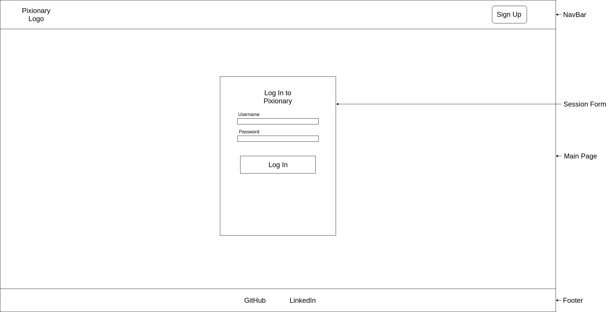
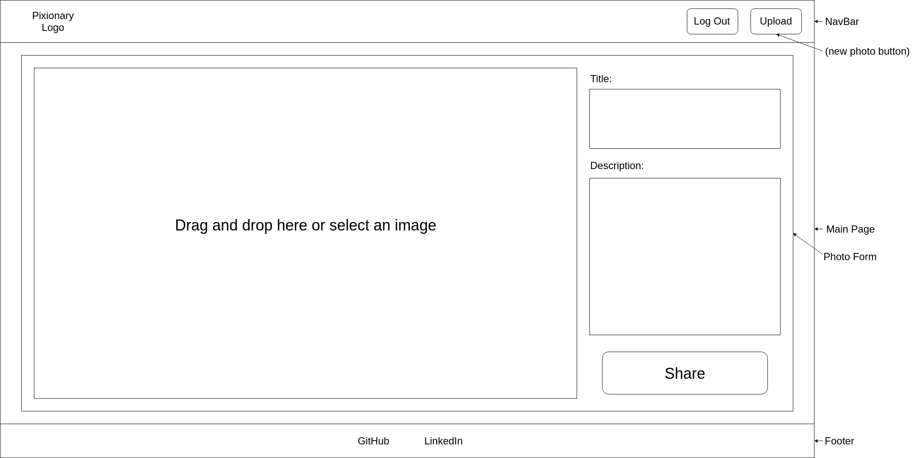
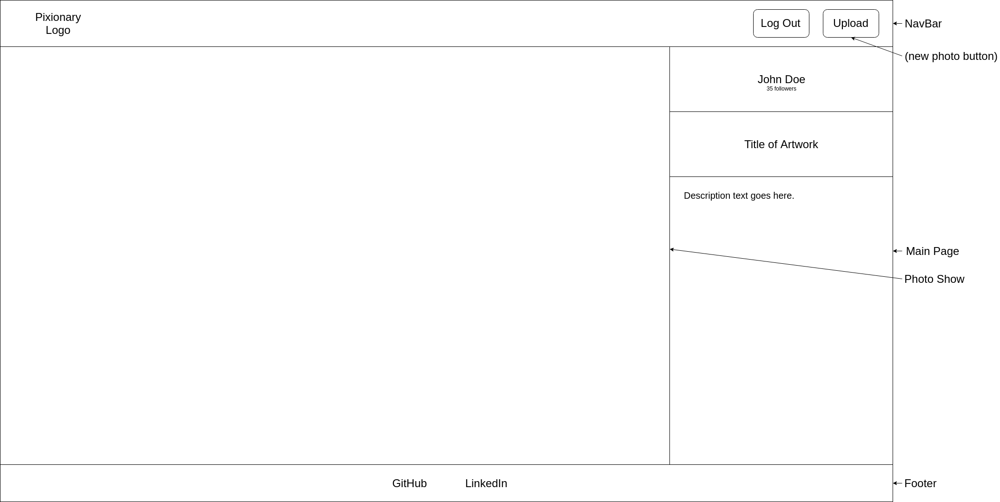
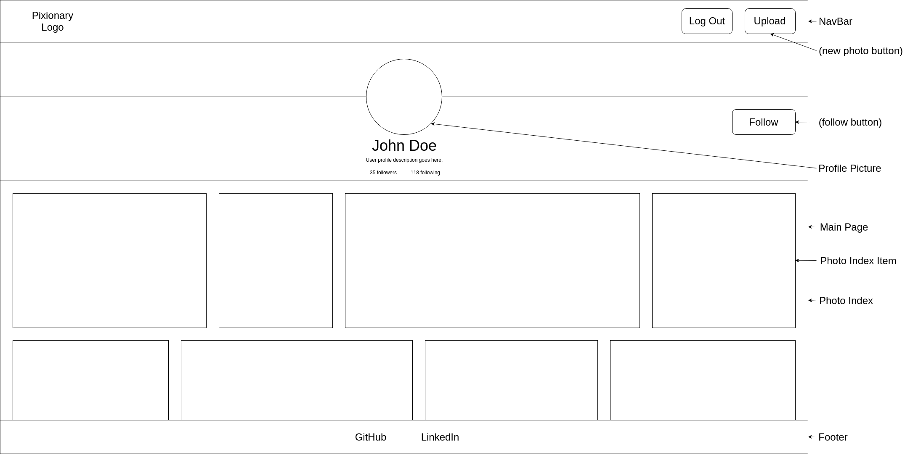
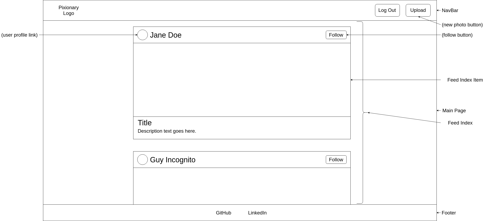

# Pixionary

[Pixionary](https://pixionary.herokuapp.com/#/) is a full-stack photography-focused web application written over the span of 10 days. Inspired by [500px](https://500px.com/), it allows users to publicly share photos to their profiles and receive a feed from other users followed.

Pixionary incorporates:

+ React.js
+ Redux
+ Ruby on Rails
+ PostgreSQL
+ jBuilder
+ jQuery AJAX
+ BCrypt
+ Cloudinary API
+ react-router
+ react-dropzone
+ superagent
+ Heroku

## Features

Pixionary can be broken down into three main features:

### Direct Photo Uploading

Pixionary users can upload photos onto their account directly.

Upon account creation and login, users can click the 'Upload Photo' link in the top right. This will redirect them to the photo upload form, from which they may select a photo within a folder management window or drag and drop a photo. They may also optionally enter a title and/or description with which to associate with the photo.

### User Profile

Pixionary users have a public profile of their own photos, and can view other users as well.

After uploading a photo, the user is automatically redirected to their profile page where they may see their photos. Alternatively, they may click their personalized greeting link adjacent to 'Upload Photo' in the top nav bar. From their profile, users may click directly on a photo in the mosaic to see it in higher resolution, as well as the title and description.

### Photo Feed

Pixionary users can see a feed of photos from their followed users.

Users who are logged in may click the 'Pixionary' logo on the left side of the nav bar to see their photo feed, which collects photos from all currently followed users. Clicking on the thumbnail of a user's profile photo or name redirects users to that profile page of the photo's author, where users may either follow or unfollow the author.

## Planning and Design

Backend, frontend, and styling decisions were guided in large part by detailed wireframes created prior to work on Pixionary.

## Planned Features

### Comments
Users will be able to publicly comment on other users' photos

### Likes
Users will be able to publicly like other users' photos and comments

### Edit Profile
Users will be able to add and edit their biographies

### Follow Buttons on Photo Feed
Users will be able to follow other users from the feed directly rather than having to do so from the profile

### Search
Users will be able to search for other users and photos

### Tags
Users will be able to label their photos with tags topics for easier searching
